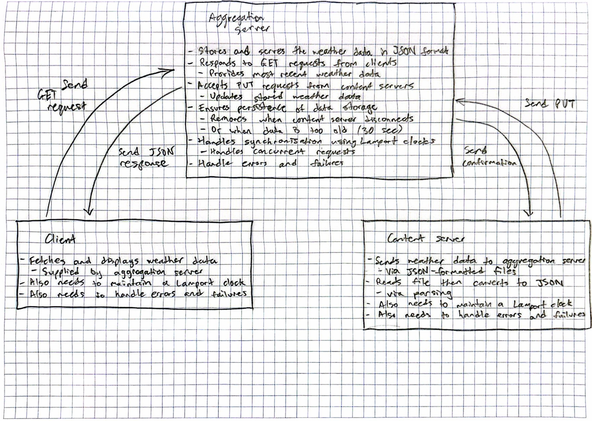

# Weather Service

This project is designed to simulate a weather service, where an aggregation server holds weather data. Content servers 
can connect to the aggregation server through a socket and PUT weather data into the database. GET clients can also 
connect, and retrieve either specified data by content server ID or the most recent data PUT into the database. The 
original design can be viewed below:



While developing the project, changes were made to the design. The content server and get client have been implemented 
as described with small changes. Both of these classes implement custom JSON parsing for the bonus marks. The lamport 
clock has also been implemented in a separate class, and each the aggregation server, content server and get client all 
maintain their own lamport clock.

The major changes from the original design can be seen in the modularity of the aggregation server. There are 6 separate 
classes; ClientRequest, Database, Handler, QueueHandler, Response and WeatherDataEntry which modularize the aggregation 
server. 
 - The ClientRequest class stores the details of each client request. 
 - The Database class stores the weather data, and has a singleton instance which is accessed by the aggregation server 
alone, which will retrieve the specified data depending on the client request. 
 - The Handler class is used to process a request. It will update the database as needed and send an appropriate 
response. 
 - The QueueHandler class is used to handle which request should be processed first. This is done using the lamport 
time stamp and PID for each request. 
 - The Response class simply builds the headers and error page (if applicable) and prints the appropriate response to 
the client. 
 - The WeatherDataEntry class is used to store information about each weather entry.

Further details about each class can be seen in the classes themselves.

Running the project manually:

First run mvn clean install in one terminal. The clean command is configured in pom.xml to delete the files which are 
created when the project is running, such as LAMPORT_CLOCK.txt. The install command will compile and test the project, 
among other things.

To run the aggregation server on the default port (4567), in the terminal run the following:

```bash
mvn exec:java -Dexec.mainClass=weatherService.AggregationServer
```

To run the content server and PUT the local content into the database with station ID 1, run the following command in 
a separate terminal:

```bash
mvn exec:java -Dexec.mainClass=weatherService.ContentServer -Dexec.args="http://localhost:4567 1 cs1.txt"
```

In another separate terminal, run the following command to GET the weather data. Ensure that 30 seconds have no elapsed.

```bash
mvn exec:java -Dexec.mainClass=weatherService.GETClient -Dexec.args="http://localhost:4567 1"
```

Please see the integrated tests for different tests. This is just an example of how to run the project. The expected 
output of this specific configuration can be seen in the PUTGETTest.txt integrated test.

Testing:

Testing the modules working alongside the Aggregation Server has been done using JUnit and Maven. These can all be run 
using mvn clean install, which will also compile the code for manual running as explained above. It should be noted 
that the Response class was not tested separately, as the Handler class tests incorporate every possible test for the 
Response class (every possible response is tested). These tests have tested each response and file creation, ensuring 
that the correct values (e.g. the lamport time stamp or the put history) have been written to the file. The requests 
from either a content server or a get client have been mocked and tested in the HandlerTest class, which tests each 
response code.

The AggregationServer class itself has its start and stop server functionality tested, however the overall functionality 
of the class in combination with the ContentServer and GETClient classes has been tested with integrated tests. The 
integrated tests can be found in the integratedTests folder, where each file contains instructions on how to perform the
test and the expected results. These tests are more general tests, which ensure that each server is properly running and
the overall functionality of the project is correct.

The purpose of the integrated tests is to check that the servers work properly together. Each integrated test has been 
tested using JUnit with mocked responses, requests, sockets, etc., in the src.test.java.weatherService directory, in the 
various testing classes.